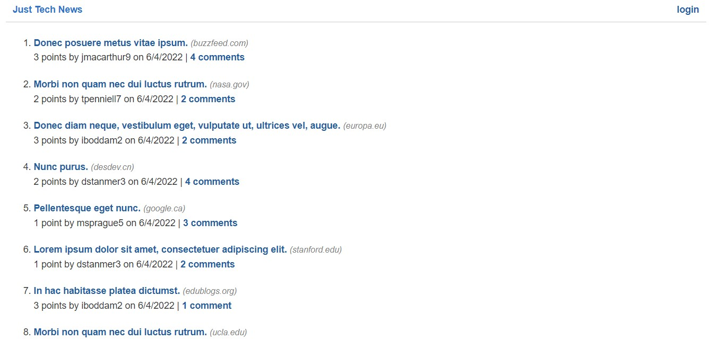

# Just Tech News

### Description
This full stack web application is a CMS-style blog that is hosted live by Heroku. It utilizes a MySQL database. Users can dynamically create an account and post on this account in a forum style. Users' posts can be commented on by other users.

### License

This application is licensed under MIT

### Application Demo

### Table of Contents
- [Description](#description)
- [Contributing](#contributing)
- [Tests](#tests)
- [Questions?](#questions)

### Contributing
No contributions at this time.

### Tests
format_date, format_url, format_plural.
### Questions
GitHub Username: (kcaseychamberlain) 

View the project in GitHub at: https://github.com/KCaseyChamberlain/just-tech-news

View the application live hosted at: https://polar-anchorage-03617.herokuapp.com/
    
If you have any questions, contact Casey at: caseygchamberlain@gmail.com